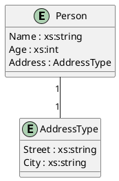

# WIP: Currently not all XSD elements are supported, but the basic structure is in place. Stay tuned.

# XSD to PlantUML Converter

## Overview
This project is a Java application that converts XSD (XML Schema Definition) files into PlantUML diagrams. It reads an XSD file, processes its structure, and generates a visual representation of the entity-relationship model in PlantUML format.

## Features
- Parse XSD files to extract entity-relationship models.
- Export the model to PlantUML format for visualization.
- Command-line interface for easy usage.

## Example
Given an XSD file like this:
```xml
<xs:schema xmlns:xs="http://www.w3.org/2001/XMLSchema">
   <xs:element name="Person">
      <xs:complexType>
         <xs:sequence>
            <xs:element name="Name" type="xs:string"/>
            <xs:element name="Age" type="xs:int"/>
            <xs:element name="Address" type="AddressType"/>
         </xs:sequence>
      </xs:complexType>
   </xs:element>
   <xs:complexType name="AddressType">
      <xs:sequence>
         <xs:element name="Street" type="xs:string"/>
         <xs:element name="City" type="xs:string"/>
      </xs:sequence>
   </xs:complexType>
</xs:schema>
```
The output in PlantUML format will look like this:



## Requirements
- Java 17 or higher
- Maven 3.6 or higher

## Installation and Usage
1. Clone the repository:
   ```bash
   git clone https://github.com/syfds/xsd2plantuml.git
   cd xsd2plantuml
   mvn clean package
   java -jar target/xsd2plantuml-jar-with-dependencies.jar schema.xsd output.puml
    ```

## Build the project using Maven:  
The executable JAR file will be located in the target directory:  
`target/xsd2plantuml-jar-with-dependencies.jar`
